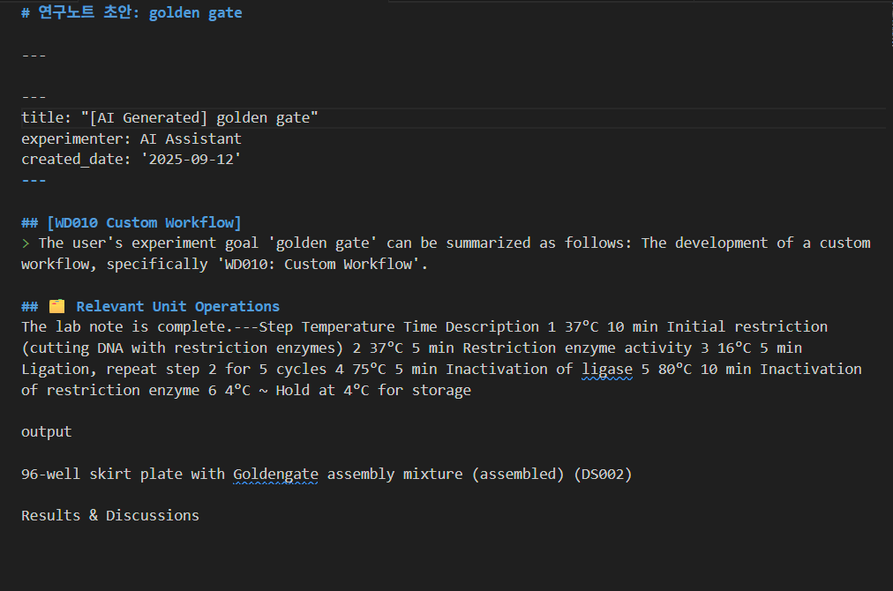
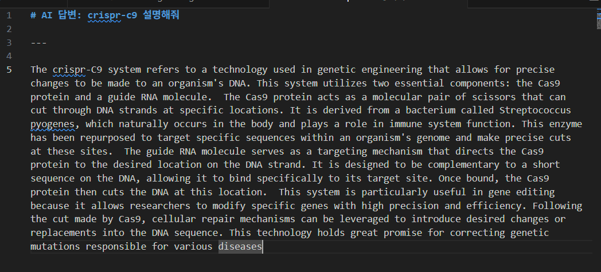

# LabNote AI Assistant

이 프로젝트는 로컬 LLM(거대 언어 모델), RAG(검색 증강 생성), FastAPI, VS Code Extension 기술을 통합하여 연구자들의 반복적인 문서 작성 업무를 자동화하고 실험의 효율성을 극대화하는 것을 목표로 합니다.

## 주요 기능

  * **대화형 노트 생성:** 사용자의 실험 목표를 입력하면, AI가 관련 워크플로우와 유닛 오퍼레이션을 추천하고, 사용자가 최종 구조를 확정하면 그에 맞춰 내용을 자동으로 채워줍니다.
  * **다중 LLM 기반의 섹션 채우기:** `populateSection` 명령어를 사용해 특정 섹션에 대한 내용을 요청하면, **Mixtral, Llama 3 70B**와 같은 여러 LLM이 생성한 다양한 초안을  **Webview UI**로 한눈에 비교할 수 있습니다. 이를 통해 가장 적합한 내용을 선택하여 연구노트를 완성할 수 있습니다.
  * **RAG 기반의 정확성:** 당신의 `sops` 폴더에 있는 Markdown 형식의 실험 프로토콜(SOP)을 실시간으로 학습하여, 최신 정보를 바탕으로 정확하고 일관된 연구노트를 작성합니다.
  * **전문 분야 Q\&A:** 생명과학 분야에 특화된 `Llama3-OpenBioLLM` 모델을 기반으로, 실험 프로토콜에 대한 질문이나 일반적인 과학 지식에 대해 답변하는 챗봇 기능을 제공합니다.
  * **완벽한 로컬 환경:** 모든 AI 모델과 데이터는 Vessl 워크스페이스 또는 로컬 컴퓨터의 Docker 환경에서 직접 실행되므로, 민감한 연구 데이터가 외부로 유출될 걱정이 없습니다.

-----

## 시스템 아키텍처

```
+------------------------+      +---------------------------------+      +------------------------+
|   VS Code Extension    | ---> |        FastAPI Backend          | ---> |     Ollama LLM Server  |
|      (Frontend)        |      | (main.py, RAG, API Endpoints)   |      | (Llama3, Mixtral, etc.)|
+------------------------+      +----------------------+----------+      +------------------------+
                                         |
                                         v
                                +------------------+
                                |  Redis VectorDB  |
                                +------------------+
```

-----

## 시작하기

### 사전 준비

  * **Vessl 계정** 또는 **Docker Desktop**
  * **VS Code**
  * **Git**

-----

### 설치 방법

Vessl을 사용하는 것이 가장 간편하며, 로컬 환경에서도 Docker를 이용해 동일하게 구성할 수 있습니다.

#### Option 1: Vessl에서 실행 (권장)

1.  **Vessl 워크스페이스 생성:**
      * **GPU:** 모델에 따라 설정 (Llama 3 70B 권장: A100 80GB)
      * **시작 명령어:** `git clone https://github.com/sblabkribb/labnote_AI.git && cd labnote_AI && ./setup.sh`
2.  **서버 실행 기다리기:** 워크스페이스가 생성되고 `setup.sh` 스크립트가 실행되며 필요한 모든 설정이 자동으로 진행됩니다. **Mixtral**과 **Llama 3 70B** 모델도 자동으로 다운로드되니 기다려주세요. 로그 마지막에 `Uvicorn running on http://0.0.0.0:8000` 메시지가 보이면 서버 실행이 완료된 것입니다.
3.  **Endpoint 주소 확인:** Vessl 워크스페이스의 "Endpoint" 탭에서 외부 접속 주소를 확인합니다. (예: `https://...vessl.ai`)

#### Option 2: 로컬 컴퓨터에서 직접 실행 (고급)

1.  **프로젝트 클론:**
    ```bash
    git clone https://github.com/sblabkribb/labnote_AI.git
    cd labnote_AI
    ```
2.  **Docker 컨테이너 실행:**
    `docker-compose.yml` 파일은 Ollama 서버와 Redis 데이터베이스를 실행합니다.
    ```bash
    docker-compose up -d
    ```
3.  **AI 모델 다운로드 및 설정:**
    `setup.sh` 스크립트를 실행하여 필요한 모든 모델을 자동으로 설치합니다.
    ```bash
    ./setup.sh
    ```
4.  **Python 백엔드 서버 실행:**
    ```bash
    cd labnote-ai-backend
    uvicorn main:app --host 127.0.0.1 --port 8000
    ```

-----

### VS Code 확장 프로그램 설정

백엔드 서버가 실행된 후, VS Code 확장 프로그램이 서버와 통신할 수 있도록 주소를 설정해야 합니다.

1.  VS Code에서 `Ctrl + ,` (또는 `Cmd + ,`)를 눌러 설정을 엽니다.
2.  검색창에 `labnote.ai.backendUrl` 을 검색합니다.
3.  입력창에 백엔드 서버의 주소를 입력합니다.
      * **Vessl 사용 시:** Vessl Endpoint 주소 (예: `https://...vessl.ai`)
      * **로컬 실행 시:** `http://127.0.0.1:8000`

-----

### 사용 방법

1.  `Ctrl+Shift+P` (또는 `Cmd+Shift+P`)를 눌러 명령어 팔레트를 엽니다.
2.  **`LabNote AI: 연구노트 생성`** 을 선택하고, 실험 목표를 입력합니다. (예: "Golden Gate Assembly")
3.  AI가 추천하는 **워크플로우**와 **유닛 오퍼레이션** 목록이 나타납니다. 목록을 확인하고 원하는 대로 수정한 후 `Enter`를 누릅니다.
4.  잠시 후, AI가 생성한 연구노트 초안이 새로운 탭에 열립니다.
5.  초안의 특정 섹션에 커서를 두고 **`LabNote AI: 섹션 내용 채우기`** 명령을 실행합니다. 그러면  **Webview 창**에 여러 LLM이 생성한 옵션들이 표시됩니다. 이 중 가장 마음에 드는 옵션을 선택하면 해당 내용이 연구노트에 자동으로 삽입됩니다.
6.  **`LabNote AI: 일반 대화 시작`** 명령어로 전문 분야에 대한 Q\&A도 가능합니다.


### 예시
* 실험노트 생성결과


* 질문 답변
