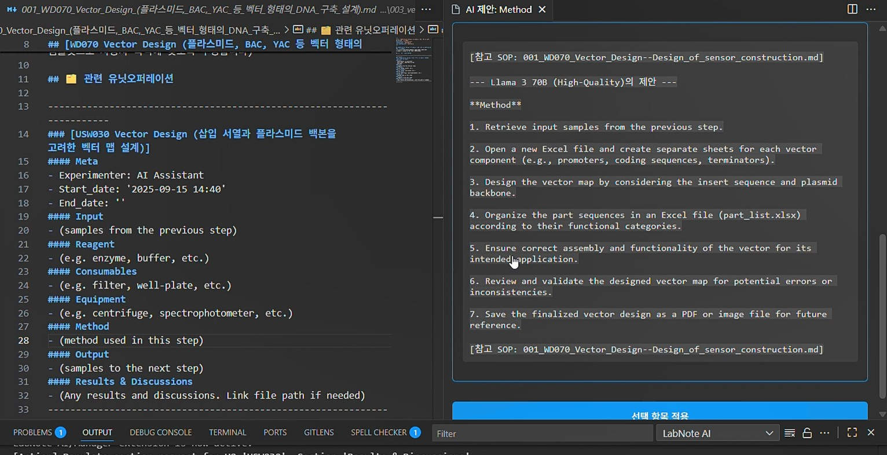
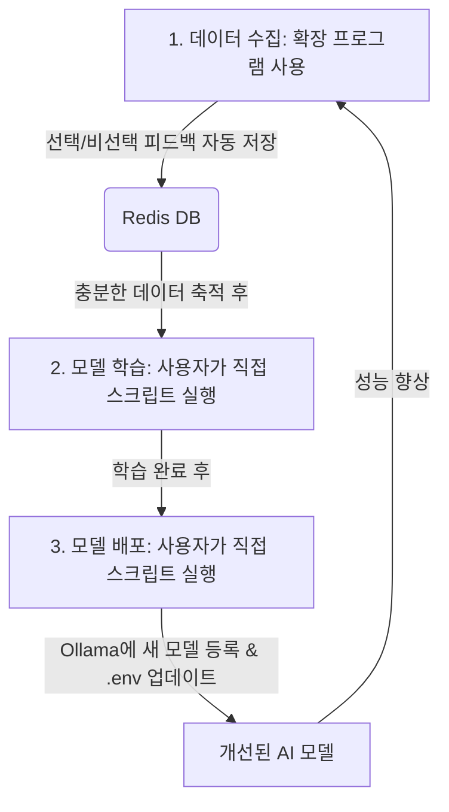

# LabNote AI Assistant & Manager

이 프로젝트는 연구노트 작성의 전 과정을 지원하는 VS Code 확장 프로그램입니다. **AI 기반의 자동 생성 기능**과 **템플릿 기반의 수동 관리 기능**을 결합하여, 연구자들이 반복적인 문서 작업을 줄이고 실험 자체에 집중할 수 있도록 돕습니다.

특히, 사용자의 피드백을 통해 AI가 스스로 학습하고 발전하는 **DPO(Direct Preference Optimization)** 기술과, **LangChain** 및 **LangGraph**를 활용한 정교한 RAG(검색 증강 생성) 및 멀티 에이전트 시스템을 핵심으로 합니다.

-----

## ✨ 주요 기능

  * **복합 노트 생성 📝:** AI가 실험 목표에 맞춰 `README.md`와 여러 개의 워크플로우 `.md` 파일을 한 번에 생성하여, 체계적인 노트 관리를 시작할 수 있습니다.
  * **워크플로우 및 유닛 오퍼레이션 수동 추가 ➕:** 생성된 노트에 언제든지 템플릿 기반으로 새로운 실험 단계(워크플로우, 유닛 오퍼레이션)를 손쉽게 추가할 수 있습니다.
  * **AI 기반 섹션 내용 채우기 (멀티 에이전트) 🤖:** 노트의 빈 섹션에 커서를 놓고 명령을 실행하면, **LangGraph**로 구축된 에이전트가 해당 섹션에 대한 여러 버전의 초안을 제안합니다.
  * **자가 학습 AI (DPO) 🧠:** 사용자가 AI가 제안한 여러 초안 중 하나를 선택하면, 이 피드백이 DPO 데이터로 기록됩니다. 이 데이터를 주기적으로 학습하여 AI 모델은 사용자의 선호에 맞게 점점 더 똑똑해집니다.
  * **폴더 및 워크플로우 번호 자동 재정렬 🔢:** 실험 폴더나 워크플로우 파일의 번호를 수동으로 변경하면 관련된 모든 링크와 리소스 폴더(`images`, `resources`) 이름이 자동으로 업데이트됩니다. 또한, 중간 번호가 삭제되어도 새로운 명령어로 폴더와 파일 번호를 한 번에 깔끔하게 재정렬합니다.
  * **자동 파일 정리 📂:** 마크다운 편집기에 이미지나 엑셀 등의 파일을 붙여넣으면, **자동으로 `images/<번호>` 또는 `resources/<번호>` 폴더에 저장**되고 링크가 삽입됩니다.
  * **표 삽입 기능 📊:** 간단히 행과 열의 개수만 입력하면, 마크다운 형식의 표를 자동으로 생성합니다.
  * **완벽한 로컬 환경 🔒:** 모든 AI 모델과 데이터는 Docker 환경에서 직접 실행되므로, 민감한 연구 데이터가 외부로 유출될 걱정이 없습니다.
  * **전문 분야 Q\&A 💬:** 생명과학 분야에 특화된 AI 모델을 통해 실험 프로토콜이나 관련 지식에 대한 질문과 답변을 얻을 수 있습니다.

-----

## 시스템 아키텍처

```
+------------------------------------+       +---------------------------------+       +------------------------+
| VS Code Extension (UI & Manager)   | --->  |         FastAPI Backend         | --->  |    Ollama LLM Server   |
| (extension.ts, logic.ts, templates)|       | (main.py, RAG, API Endpoints)   |       | (Llama3, Mixtral, etc.)|
+------------------------------------+       +----------------------+----------+       +------------------------+
                                                       |
                                                       v
                                              +------------------+
                                              |  Redis VectorDB  |
                                              +------------------+
```

-----

## 🛠️ 기술 스택 및 핵심 원리

### LangChain을 활용한 RAG 및 멀티 에이전트 시스템

본 프로젝트는 **LangChain** 프레임워크를 적극적으로 활용하여 AI의 답변 정확성과 모듈성을 극대화합니다.

1.  **RAG (검색 증강 생성) 파이프라인 (`rag_pipeline.py`):**

      * **문서 로딩:** `DirectoryLoader`가 사용자의 `sops` 폴더에 있는 모든 `.md` 실험 프로토콜을 로드합니다.
      * **분할 및 임베딩:** `RecursiveCharacterTextSplitter`로 문서를 의미 있는 단위로 분할하고, `OllamaEmbeddings`를 통해 벡터로 변환합니다.
      * **벡터 저장소:** 변환된 벡터는 **Redis**에 벡터 데이터베이스로 저장되어 빠른 검색을 가능하게 합니다.
      * **검색:** 사용자가 섹션 내용 채우기를 요청하면, AI는 질문과 가장 관련된 SOP 내용을 Redis에서 검색하여 답변의 근거 자료로 활용합니다.

2.  **LangGraph 기반 멀티 에이전트 (`agents.py`):**

      * 단일 AI가 모든 작업을 처리하는 대신, **LangGraph**를 사용하여 각기 다른 전문성을 가진 에이전트 팀을 구성했습니다.
      * **라우터(Router):** 사용자가 'Method' 섹션을 채우려 하는지, 'Reagent' 섹션을 채우려 하는지 판단하여 가장 적합한 전문 에이전트에게 작업을 분배합니다.
      * **전문 에이전트:** 각 에이전트는 RAG 파이프라인을 통해 얻은 정보를 바탕으로, 담당 섹션에 최적화된 내용의 초안을 생성합니다. 이를 통해 보다 구조적이고 정확한 결과물을 만들어냅니다.

### DPO(Direct Preference Optimization)를 통한 자가 학습 모델

이 시스템의 핵심은 사용자와의 상호작용을 통해 AI가 스스로 발전하는 **지능형 선순환(Intelligent Flywheel)** 구조입니다.

  * **피드백 수집:** 사용자가 `섹션 내용 채우기` 기능으로 제안된 여러 초안 중 하나를 선택하면, \*\*선택된 답변(Chosen)\*\*과 \*\*거부된 답변(Rejected)\*\*이 쌍으로 묶여 Redis에 DPO 데이터로 저장됩니다 (`main.py`의 `/record_preference`).
  * **모델 재학습 및 배포 자동화:**
    `run_full_dpo_pipeline.sh` 스크립트 하나로 DPO 학습부터 모델 배포, 서버 재시작까지 전체 과정을 자동화합니다.
      * `run_dpo_training.py` 스크립트가 Redis에 축적된 사용자 선호도 데이터를 가져와 `Llama3-OpenBioLLM` 모델을 미세조정(Fine-tuning)합니다.
      * `deploy_model.sh` 스크립트는 학습된 모델을 GGUF 형식으로 변환하고 Ollama에 등록합니다.
      * 스크립트는 `pgrep`과 `kill` 명령을 사용해 기존 `uvicorn` 서버를 안전하게 종료한 후, 새 모델이 적용된 서버를 `nohup`으로 백그라운드에서 다시 시작합니다.
  * **지속적인 개선:** 재학습된 모델을 시스템에 적용하면, 다음번에 더 사용자의 의도에 맞는, 고품질의 초안을 제안하게 됩니다.

-----

## 🚀 RAG 성능 향상을 위한 실험 노트 업로드 안내

LabNote AI는 여러분의 실험 SOP(`sops` 폴더 내 `.md` 파일)를 학습하여, 더 정확하고 맞춤화된 답변을 제공합니다. RAG 기능을 최대한 활용하고 AI의 답변 품질을 높이기 위해, 개인 또는 팀의 표준 실험 프로토콜(SOP)을 `labnote-ai-backend/sops` 폴더에 마크다운(`.md`) 형식으로 자유롭게 업로드해 주세요.

-----

## 시작하기

### 사전 준비

  * **Docker Desktop**
  * **VS Code**
  * **Git**

### 설치 방법

  - 로컬 컴퓨터 실행 기준 - (vessl.ai 등도 가능)

<!-- end list -->

1.  **프로젝트 클론:**
    ```bash
    git clone https://github.com/sblabkribb/labnote_ai.git
    cd labnote_ai
    ```
2.  **Docker 컨테이너 실행:**
    (Ollama 서버와 Redis 데이터베이스를 실행합니다.)
    ```bash
    docker-compose up -d
    ```
3.  **AI 모델 다운로드 및 설정:**
    (스크립트를 실행하여 필요한 모든 모델을 자동으로 설치합니다.)
    ```bash
    ./setup.sh
    ```
4.  **Python 백엔드 서버 실행:**
    ```bash
    cd labnote-ai-backend
    uvicorn main:app --host 127.0.0.1 --port 8000
    ```

-----

### VS Code 확장 프로그램 설정

1.  `vscode-labnote-extension` 폴더를 VS Code에서 엽니다.
2.  터미널에서 `npm install`을 실행합니다.
3.  `F5` 키를 눌러 확장 프로그램을 디버그 모드로 실행합니다.
4.  새로운 VS Code 창이 나타나면, `Ctrl + ,`를 눌러 설정을 열고 `labnote.ai.backendUrl`을 검색하여 백엔드 서버 주소(`http://127.0.0.1:8000`)가 올바르게 입력되었는지 확인합니다.

-----

## 사용 방법

**`Ctrl+Shift+P`** (또는 `Cmd+Shift+P`)를 눌러 명령어 팔레트를 열고 다음 명령어를 사용하세요.

### 1\. 연구노트 자동 생성 (AI)

  * **명령어:** `LabNote: 새 연구노트 생성`
  * **설명:**
    1.  실험 주제를 입력합니다. (예: "Vector Design")
    2.  나타나는 목록에서 관련된 **워크플로우** 1개를 선택합니다.
    3.  다음 목록에서 해당 워크플로우에 포함할 **유닛 오퍼레이션**들을 **체크박스로 여러 개** 선택하고 `OK`를 누릅니다.
    4.  AI가 `labnotes/001_Vector_Design` 폴더와 그 안에 `README.md`, 그리고 선택한 내용을 바탕으로 구성된 워크플로우 `.md` 파일들을 한 번에 생성해 줍니다.

### 2\. 연구노트 수동 확장 및 관리 (Manager)

#### 워크플로우(Workflow) 추가

  * **실행 위치:** `labnotes/001.../README.md` 파일 안에서 명령을 실행합니다.
  * **명령어:** `LabNote: 새 워크플로우 추가`
  * **설명:** 템플릿 목록에서 새 워크플로우를 선택하여 `.md` 파일을 추가하고 `README.md`에 링크를 자동으로 생성합니다.

#### 유닛 오퍼레이션(Unit Operation) 추가

  * **실행 위치:** 워크플로우 `.md` 파일 안에서 명령을 실행합니다.
  * **명령어:** `LabNote: HW Unit Operation 추가` 또는 `SW Unit Operation 추가`
  * **설명:** 현재 워크플로우에 필요한 세부 실험 절차(유닛 오퍼레이션) 블록을 삽입합니다.

#### 표(Table) 삽입

  * **실행 위치:** 아무 `.md` 파일 안에서나 실행 가능합니다.
  * **명령어:** `LabNote: 표 삽입`
  * **설명:** 행과 열의 개수를 입력하면 커서 위치에 마크다운 표를 자동으로 생성합니다.

#### 번호 재정렬

  * **명령어:** `LabNote: 워크플로우 번호 재정렬`

      * **실행 위치:** 특정 실험 폴더 안의 `README.md` 파일에서 실행합니다.
      * **설명:** 해당 실험 폴더 내의 워크플로우 파일(`001_...md` 등)과 관련 리소스(`images/001` 등), `README.md` 링크의 번호를 순서대로 다시 정렬합니다.

  * **명령어:** `LabNote: 실험 폴더 번호 재정렬`

      * **실행 위치:** VS Code 작업 영역 어디에서든 실행 가능합니다.
      * **설명:** `labnote` 폴더 아래의 모든 실험 폴더(`001_...`, `003_...` 등) 번호를 순서대로 다시 정렬합니다.

### 3\. 내용 채우기 및 질문 (AI)

#### 섹션 내용 채우기

  * **실행 위치:** 유닛 오퍼레이션의 빈 섹션(예: `(method used in this step)`)에 커서를 놓고 실행합니다.
  * **명령어:** `LabNote (AI): 섹션 내용 채우기`
  * **설명:** AI가 여러 버전의 초안을 제안하면, 가장 적합한 내용을 선택하여 노트를 완성합니다.

#### 일반 대화 (Q\&A)

  * **명령어:** `LabNote (AI): 일반 대화 시작`
  * **설명:** 실험 프로토콜이나 관련 지식에 대해 AI에게 자유롭게 질문하고 답변을 받습니다.

### 예시

아래 이미지를 클릭하면 유튜브 영상으로 이동합니다.
[](https://youtu.be/syWqqiyTmsE)

-----

## 🧠 AI 모델 자가 학습 및 배포 (DPO)

이 확장 프로그램의 AI는 사용자의 피드백을 통해 계속 성능이 향상될 수 있습니다. 전체 과정은 **데이터 수집 → 모델 학습 → 모델 배포** 3단계로 이루어집니다.



### **1단계: 데이터 수집 (자동)**

  * **언제:** 사용자가 `LabNote (AI): 섹션 내용 채우기` 기능을 사용하고 AI가 제안한 여러 옵션 중 하나를 선택할 때마다 자동으로 실행됩니다.
  * **설명:** 선택된 답변(Chosen)과 거부된 답변(Rejected)이 사용자의 선호도 데이터로 Redis 데이터베이스에 자동으로 축적됩니다. 확장 프로그램을 많이 사용할수록 더 품질 좋은 학습 데이터가 쌓입니다.

### **2단계: DPO 파이프라인 실행 (자동화)**

  * **언제:** 충분한 피드백 데이터가 쌓였다고 생각될 때, 사용자가 **단일 스크립트 실행**으로 모든 과정을 자동화합니다.
  * **방법:** 터미널을 열고 다음 명령어를 입력하세요.
    ```bash
    cd labnote-ai-backend
    sh run_full_dpo_pipeline.sh
    ```
  * **설명:** 이 스크립트는 다음 과정을 순차적으로 자동 처리합니다.
    1.  Redis에 저장된 모든 선호도 데이터를 가져와 `Llama3-OpenBioLLM` 모델을 학습합니다.
    2.  학습된 모델을 Ollama가 사용할 수 있는 GGUF 형식으로 변환 및 양자화합니다.
    3.  새로운 모델을 Ollama에 등록하고, `.env` 파일의 `LLM_MODEL` 변수를 새 모델 이름으로 업데이트합니다.
    4.  기존 `uvicorn` 서버 프로세스를 종료하고, 최신 모델을 로드한 새 서버를 백그라운드에서 다시 실행합니다.

이 과정을 거치면, 확장 프로그램은 이제부터 사용자의 선호도가 반영된, 더욱 향상된 AI 모델을 사용하게 됩니다.

-----